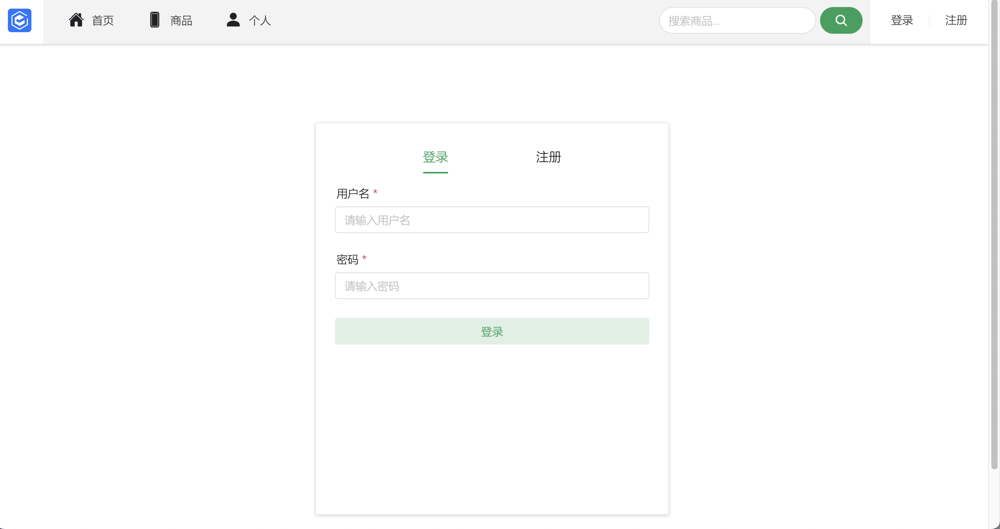

<div class="cover" style="page-break-after:always;font-family:方正公文仿宋;width:100%;height:100%;border:none;margin: 0 auto;text-align:center;">
    <div style="width:60%;margin: 0 auto;height:0;padding-bottom:10%;">
        </br>
        
    </div>
    </br></br></br></br></br>
    <div style="width:60%;margin: 0 auto;height:0;padding-bottom:40%;">
        
	</div>
    </br></br></br></br></br></br></br></br>
    <span style="font-family:华文黑体Bold;text-align:center;font-size:20pt;margin: 10pt auto;line-height:30pt;">《BS 体系软件设计》</span>
    <table style="border:none;text-align:center;width:72%;font-family:仿宋;font-size:14px; margin: 0 auto;">
    <tbody style="font-family:方正公文仿宋;font-size:12pt;">
    	<tr style="font-weight:normal;"> 
    		<td style="width:20%;text-align:right;">题　　目</td>
    		<td style="width:2%">：</td> 
    		<td style="width:40%;font-weight:normal;border-bottom: 1px solid;text-align:center;font-family:华文仿宋"> 《BS 体系软件设计》大程设计报告</td>     </tr>
    	<tr style="font-weight:normal;"> 
    		<td style="width:20%;text-align:right;">授课教师</td>
    		<td style="width:2%">：</td> 
    		<td style="width:40%;font-weight:normal;border-bottom: 1px solid;text-align:center;font-family:华文仿宋">胡晓军 </td>     </tr>
    	<tr style="font-weight:normal;"> 
    		<td style="width:20%;text-align:right;">姓　　名</td>
    		<td style="width:2%">：</td> 
    		<td style="width:40%;font-weight:normal;border-bottom: 1px solid;text-align:center;font-family:华文仿宋"> 周玥儿</td>     </tr>
    	<tr style="font-weight:normal;"> 
    		<td style="width:20%;text-align:right;">学　　号</td>
    		<td style="width:2%">：</td> 
    		<td style="width:40%;font-weight:normal;border-bottom: 1px solid;text-align:center;font-family:华文仿宋">3220102179 </td>
    	<tr style="font-weight:normal;"> 
    		<td style="width:20%;text-align:right;">日　　期</td>
    		<td style="width:2%">：</td> 
    		<td style="width:40%;font-weight:normal;border-bottom: 1px solid;text-align:center;font-family:华文仿宋">2024年11月15日</td>     </tr>
    </tbody>              
    </table>
</div>


[TOC]

## 1 项目概述

### 1.1 项目背景

在电子商务日益普及的背景下，用户对商品价格的比较和获取变得更加重要。此项目旨在开发一个比价系统，用户可以通过该系统查询主流电商平台的商品价格，获取历史价格走势，并在价格下降时接收提醒。
### 1.2 项目目标

构建一个能够查询商品价格、提供价格走势图和降价提醒的比价系统，支持用户注册与登录，并实现移动端友好显示。

### 1.3 功能需求

#### 1.3.1 用户注册与登录

- **用户注册**:
  - 填写必要信息（用户名、密码、邮箱等）
  - 验证信息有效性：
    - 用户名、密码长度至少为6字节
    - 邮箱格式验证
    - 确保用户名和邮箱在系统中唯一
- **用户登录**:
  - 验证用户名和密码的正确性
  - 登录后可访问系统的其他功能

#### 1.3.2 商品价格查询

- **通过商品名称查询**:
  - 分词处理优化查询
  - 支持查询多个结果
  - 支持至少两个平台（如淘宝、京东）的价格查询
  - 针对需要用户登录的电商平台，支持用户验证
  - 显示商品信息并提供历史价格走势图表

#### 1.3.3 商品库建立

- **数据库设计**:
  - 保存商品信息，包括名称、多级品类、规格、条码、图片等
  - 支持商品价格的历史记录

#### 1.3.4 降价提醒功能

- 定时查询指定商品的最新价格
- 提供降价提醒方式（邮件、App推送等）

#### 1.3.5 移动端适配

- 优化样式以适应手机浏览器、微信等应用内置浏览器
- 如果开发手机App，支持相机拍摄商品图片或扫码条码查询商品 

### 1.4 技术架构

#### 1.4.1 前端技术栈

- Vue 3
- TypeScript
- Vite
- Pinia (状态管理)
- Naive UI (组件库)
- Axios (HTTP客户端)
- ECharts (图表可视化)

#### 1.4.2 后端技术栈

- Flask (Python Web框架)
- MySQL (数据库)
- Redis (缓存，可选)
- Celery (异步任务队列，用于价格监控)
- JWT (用户认证)

## 2 系统架构设计

### 2.1 整体架构

- 前端层：SPA应用 + 移动端适配
- 接口层：RESTful API
- 服务层：业务逻辑处理
- 数据层：MySQL存储 + Redis缓存
- 任务层：异步任务处理

### 2.2 系统模块划分

1. 用户认证模块
2. 商品搜索模块
3. 价格比较模块
4. 数据采集模块
5. 价格监控模块
6. 系统管理模块

## 3 功能模块设计

### 3.1 用户认证模块



#### 3.1.1 功能描述

- 用户注册：邮箱验证、用户名密码设置、基本信息填写
- 用户登录：账号密码登录、记住登录状态
- 密码重置：邮箱验证重置、安全问题验证
- 个人信息管理：基本信息修改、密码修改、通知设置

####  3.1.2 核心组件设计

1. 用户认证页面(登录注册)
```typescript
interface UserState {
  isLoggedIn: boolean;
  userInfo: {
    id: number;
    username: string;
    email: string;
    avatar?: string;
    preferences: UserPreferences;
  };
  token: string;
}
```

2. 用户信息页面
3. 状态管理 (LoginStore)
#### 3.1.3 功能实现流程

1. 用户注册流程


2. 登录认证流程


#### 3.1.4 安全考虑
1. 密码安全
- 使用bcrypt进行密码加密存储
- 密码强度要求：最少6位，包含大小写字母和数字

2. 会话安全
- JWT Token存储在localStorage
- Token有效期为24小时
- 使用refresh token机制

### 3.2 商品搜索模块

- 未登录前的首页以搜索框的形式呈现

- 搜索结果展示（还需要添加筛选模块）

#### 3.2.1 功能描述
1. 商品名称搜索
   - 支持中文分词搜索
   - 搜索结果排序（价格、平台等）
   - 搜索历史本地存储
3. 条码扫描搜索
   - 移动端相机扫码
   - 条码图片识别
   - 商品快速定位

#### 3.2.2 核心组件设计
1. 搜索栏组件 
2. 商品列表组件
3. 筛选组件 
4. 状态管理 (SearchStore)
#### 3.2.3 功能实现流程

1. 搜索流程


2. 条码扫描流程


### 3.3 价格比较模块


#### 3.3.1 功能描述
1. 多平台价格展示：同款商品多平台比对，价格、优惠、运费展示，商品详情信息对比，店铺信息与评分展示
2. 价格历史趋势：价格走势图表展示，历史最高/最低价标注，价格波动分析，自定义时间区间查看

#### 3.3.2 核心组件设计
1. 商品详情页面 
1. 价格趋势图表
1. 商品图轮播
1. 平台列表组件
1. 价格状态管理
#### 3.3.3 功能实现流程

1. 价格比较流程


2. 价格监控更新流程


### 3.4 价格监控模块


#### 3.4.1 功能描述
1. 降价提醒设置：目标价格设置、监控时间设置、多商品批量监控
2. 消息推送配置：邮件通知、短信推送、App推送
3. 监控历史记录：价格变动记录、触发记录查看、历史记录导出、数据可视化

#### 3.4.2 核心组件设计
1. 价格提醒设置 
2. 提醒列表组件 
3. 历史记录组件
4. 监控状态管理 (AlertStore)
#### 3.4.3 功能实现流程

1. 监控任务处理流程


2. 通知发送流程


## 4 数据库设计

### 4.1 数据库架构


### 4.2 核心表结构

1. Item

| 列名          | 数据类型     | 描述                           |
| ------------- | ------------ | ------------------------------ |
| id            | Integer      | 主键                           |
| title         | String(200)  | 商品标题（必填）               |
| search_title  | String(255)  | 用于中文分词的搜索标题（必填） |
| link          | String(255)  | 商品链接（必填）               |
| image_url     | String(255)  | 图片链接（可选）               |
| create_time   | DateTime     | 创建时间                       |
| update_time   | DateTime     | 更新时间                       |
| current_price | Float        | 当前价格（必填）               |
| platform      | String(100)  | 商品所在的平台（可选）         |
| platform_info | Relationship | 与 `Platform` 表的关系         |
| shop          | String(255)  | 商店名称（可选）               |
| shop_link     | String(255)  | 商店链接（可选）               |
| sku           | String(255)  | SKU 编号（唯一）               |
| has_detail    | Boolean      | 是否收集过详情                 |

**唯一约束：**

- (`title`, `shop`) 的联合唯一约束

2. Platform

| 列名     | 数据类型    | 描述                     |
| -------- | ----------- | ------------------------ |
| id       | BigInteger  | 主键                     |
| name     | String(50)  | 平台名称（必填，唯一）   |
| logo_url | String(255) | 平台 logo 的链接（可选） |

3. PriceAlert

| 列名                | 数据类型   | 描述                                   |
| ------------------- | ---------- | -------------------------------------- |
| id                  | Integer    | 主键                                   |
| user_id             | Integer    | 外键，指向 `users` 表的用户 ID（必填） |
| item_id             | Integer    | 外键，指向 `items` 表的商品 ID（必填） |
| target_price        | Float      | 触发警报的目标价格（必填）             |
| created_at          | DateTime   | 创建时间                               |
| updated_at          | DateTime   | 最后更新时间                           |
| enable              | Boolean    | 是否启用该价格提醒                     |
| check_interval      | Integer    | 检查价格的间隔时间（单位：分钟）       |
| notification_method | String(50) | 提醒通知方式（必填）                   |

**唯一约束：**
- (`user_id`, `item_id`) 的联合唯一约束

---

4. AlertHistory

| 列名                | 数据类型       | 描述                         |
| ------------------- | -------------- | ---------------------------- |
| id                  | Integer        | 主键                         |
| alert_id            | Integer        | 外键，指向 `PriceAlert` 表   |
| price_before        | Numeric(10, 2) | 提醒触发前的商品价格         |
| price_after         | Numeric(10, 2) | 提醒触发后的商品价格         |
| notification_status | JSON           | 通知状态（以 JSON 格式存储） |
| created_at          | DateTime       | 创建时间                     |

**索引：**
- `alert_id` 列的索引
- `created_at` 列的索引

---

5. PriceHistory

| 列名        | 数据类型       | 描述                                       |
| ----------- | -------------- | ------------------------------------------ |
| id          | Integer        | 主键                                       |
| item_id     | Integer        | 外键，指向 `items` 表的商品 ID（必填）     |
| platform_id | Integer        | 外键，指向 `platforms` 表的平台 ID（必填） |
| price       | Numeric(10, 2) | 商品在某一时刻的价格                       |
| date        | TIMESTAMP      | 记录价格的时间                             |

**索引：**
- (`item_id`, `platform_id`) 的联合索引

6. ItemDetail

| 列名        | 数据类型  | 描述                                       |
| ----------- | --------- | ------------------------------------------ |
| id          | Integer   | 主键                                       |
| item_id     | Integer   | 外键，指向 `items` 表的商品 ID（必填）     |
| platform_id | Integer   | 外键，指向 `platforms` 表的平台 ID（必填） |
| region      | String    | 产地                                       |
| update_at   | TIMESTAMP | 更新的时间                                 |
|             |           |                                            |
|             |           |                                            |
|             |           |                                            |
|             |           |                                            |

## 5 API接口设计

### 5.1 接口规范

#### 5.1.1 基础规范
- 基础路径: `/api`
- 请求方法: 严格遵循 RESTful 规范
- 响应格式: 统一使用 JSON 格式
- 状态码: 遵循 HTTP 标准状态码
- 认证方式: JWT Token (在 Header 中使用 `Authorization: Bearer <token>`)

#### 5.1.2 响应格式
```json
{
    "code": 0,           // 业务状态码，0表示成功
    "message": "success", // 状态描述
    "data": {            // 业务数据
        // 具体数据结构
    },
    "timestamp": "2024-11-13T10:00:00Z"  // 响应时间戳
}
```

#### 5.1.3 错误处理
```json
{
    "code": 1,        // 错误码
    "message": "Invalid parameter", // 错误描述
    "details": {         // 详细错误信息
        "field": "username",
        "reason": "length must be at least 6 characters"
    },
    "timestamp": "2024-11-13T10:00:00Z"
}
```

#### 5.1.4 分页参数
- page: 当前页码，默认1
- size: 每页大小，默认20
- sort: 排序字段
- order: 排序方向 (asc/desc)

### 5.2 接口清单

#### 5.2.1 用户认证类接口

1. 用户注册
```
POST /api/user/signup
Request:
{
    "username": string,  // 用户名
    "password": string,  // 密码
    "email": string,     // 邮箱
}
Response:
{
	// 通过状态码反映是否注册成功
}
```

2. 用户登录
```
POST /api/user/login
Request:
{
    "username": string,  // 用户名/邮箱
    "password": string,  // 密码
}
Response:
{
    "token": string,
}
```

3. 重置密码
```
POST /api/auth/reset-password
Request:
{
    "email": string
}
```

4. 验证邮箱
```
GET /api/auth/verify-email
Query:
- token: string  // 验证token
```

#### 5.2.2 用户信息类接口

1. 获取用户信息
```
GET /api/user/auth/loginInfo
Response:
{
    "username": string,
    "email": string,
    "avatar": string,
    "watchList": [{
    	"item_id": integer,
    	"create_at": Date,
    	"target_price" float,
        ...
    },]
}
```

2. 更新用户信息
```
PUT /api/user/auth/loginInfo
Request:
{
    "avatar": string,
    "watchList": object
}
```

#### 5.2.3 商品搜索类接口

1. 商品搜索
```
GET /api/search
Query:
- keyword: string       // 搜索关键词
- order: string 		// 	结果排序
- price_min: number    // 最低价
- price_max: number    // 最高价
- platform: string[]   // 平台筛选
- page: number        // 页码
- size: number        // 每页数量
```

2. 商品详情

```
GET /api/items/:id
```

#### 5.2.4 价格比较类接口

1. 获取商品价格对比
```
GET /api/items/:id/prices
Query:
- platforms: string[]  // 指定平台
```

2. 获取历史价格
```
GET /api/items/:id/price-history
Query:
- platform: string    // 平台ID
- start_date: string  // 开始日期
- end_date: string    // 结束日期
```

#### 5.2.5 价格监控类接口

1. 创建价格提醒
```
POST /api/alerts
Request:
{
    "itemId": string,
    "targetPrice": number,
    "notificationMethods": string[],
    "notificationInverval": integer,
}
```

2. 获取提醒列表
```
GET /api/alerts
Query:
- status: string    // 提醒状态
- page: number
- size: number
```

3. 更新提醒设置
```
PUT /api/alerts/:id
Request:
{
    "targetPrice": number,
    "notificationMethods": string[],
    "notificationInverval": integer,
}
```

4. 获取提醒历史
```
GET /api/alerts/:id/history
Query:
- start_date: string
- end_date: string
- page: number
- size: number
```

### 5.3 接口权限控制

#### 5.3.1 权限等级
1. 公开接口（无需认证）
- 商品搜索
- 商品分类
- 价格对比查看

2. 用户接口（需要认证）
- 用户信息操作
- 搜索历史
- 价格监控设置

## 6 Docker部署方案

Docker利用容器来运行前端、后端和数据库服务，每个服务都在独立的容器中运行，互相隔离又可通过网络互联。

Docker分别为前端、后端和数据库创建独立的容器。例如，前端的Vue应用、后端的Flask API和MySQL数据库都在独立的容器中运行，相当于在同一台主机上拥有多个轻量级的“沙盒”。Docker提供了一个内部网络，容器之间可以通过Docker网络中的服务名称相互访问。

所以需要编写Dockerfile构建前后端镜像，配置Docker Compose来协调前后端和数据库的启动，最后进行容器化的访问。

### 6.1 项目目录结构

```
project-root/
├── frontend/                  # 前端代码
│   ├── Dockerfile             # 前端Dockerfile
│   ├── src/                   # Vue项目的源码
│   ├── package.json           # 前端依赖文件
│   └── ...
├── backend/                   # 后端代码
│   ├── Dockerfile             # 后端Dockerfile
│   ├── app.py                 # Flask应用主文件
│   ├── requirements.txt       # Flask依赖文件
│   └── ...
├── docker-compose.yml         # Docker Compose文件
└── ...
```

```yaml
version: '3'
services:
  frontend:
    build:
      context: .
      dockerfile: frontend/Dockerfile
    ports:
      - "80:80"          # 主机80端口映射到前端80端口

  backend:
    build:
      context: .
      dockerfile: backend/Dockerfile
    environment:
      - DB_HOST=db
      - DB_USER=root
      - DB_PASSWORD=example
      - DB_NAME=mydatabase
    ports:
      - "5000:5000"      # 主机5000端口映射到后端5000端口
    depends_on:
      - db

  db:
    image: mysql:5.7
    environment:
      MYSQL_ROOT_PASSWORD: example
      MYSQL_DATABASE: mydatabase
    ports:
      - "3306:3306"      # 主机3306端口映射到数据库3306端口
    volumes:
      - db_data:/var/lib/mysql

volumes:
  db_data:
```

- **前端访问**：通过`http://localhost`访问前端应用，Vue应用会静态打包后由Nginx服务提供。
- **后端访问**：通过`http://localhost:5000`访问后端API。
- **数据库连接**：后端Flask应用可以通过`db:3306`访问数据库服务
- 启动后，前端可以通过主机80端口访问，后端通过5000端口访问，内部服务之间通过Docker网络相互通信，实现高效、稳定的部署方案。

## 7 附录

### 7.1 路由设计思维导图


### 7.2 组件设计思维导图


### 7.3 LOGO设计


