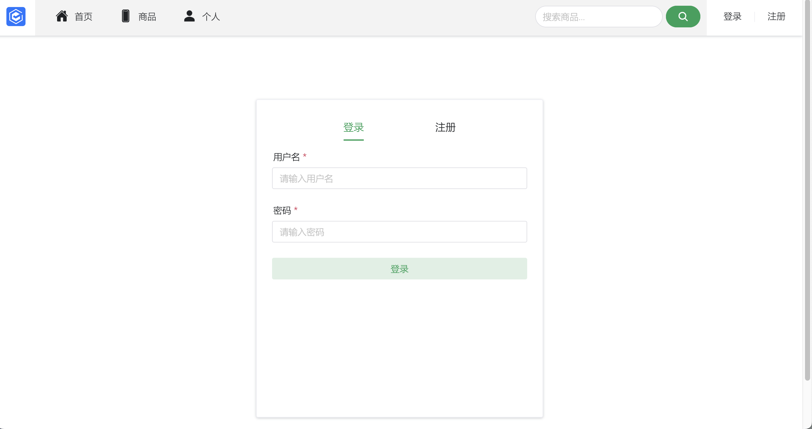
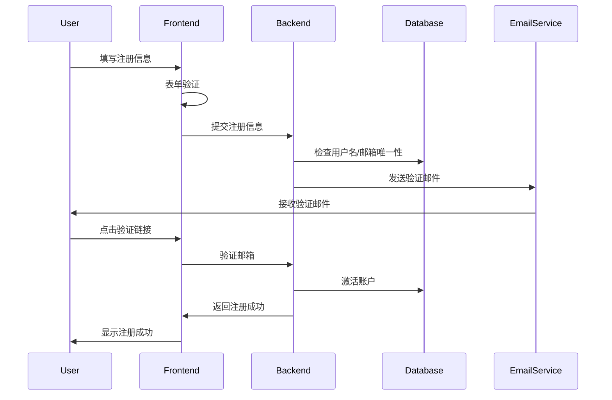
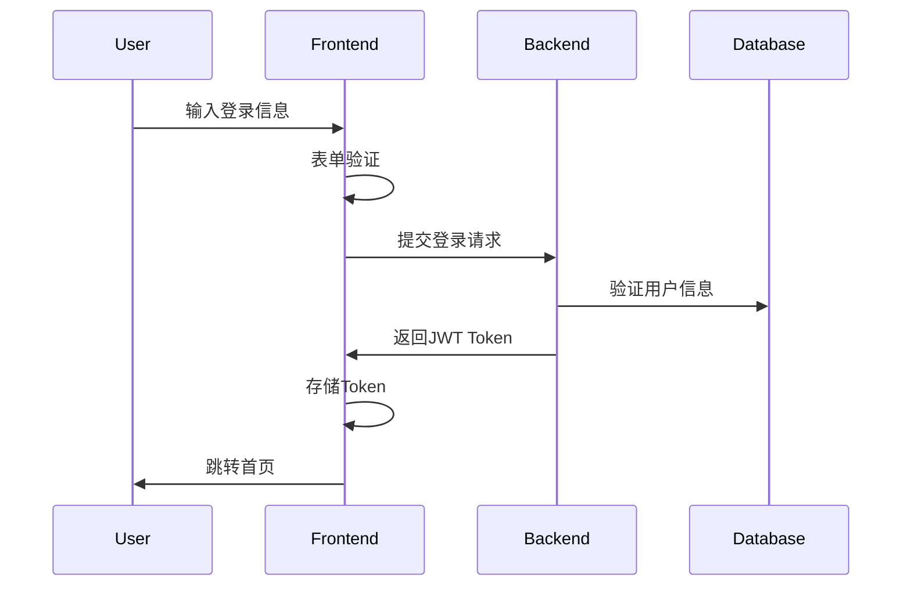
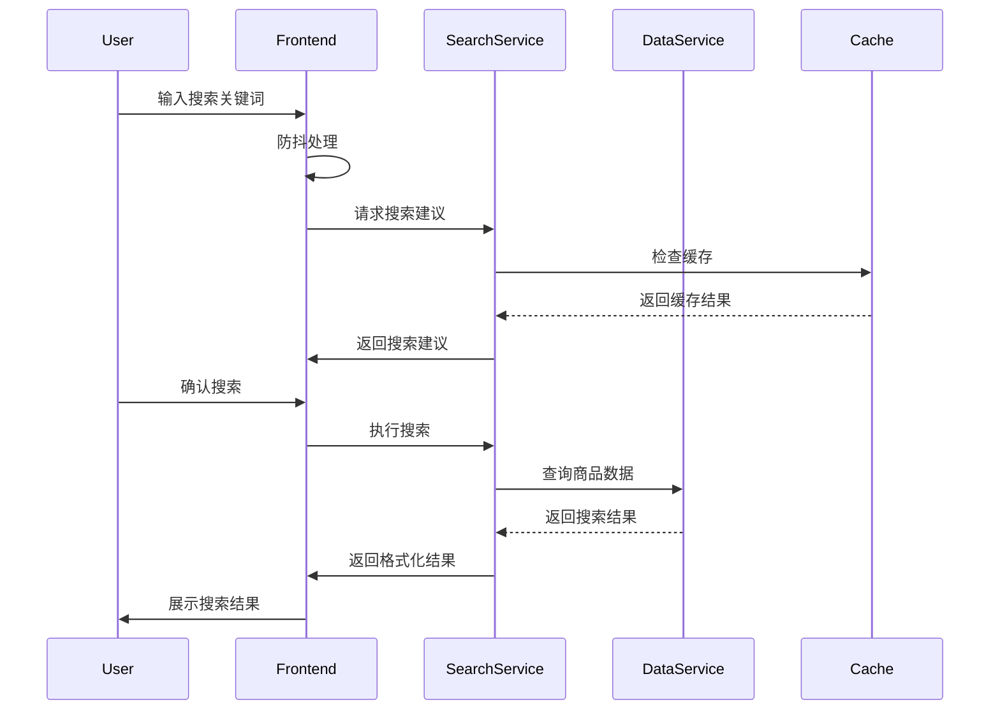
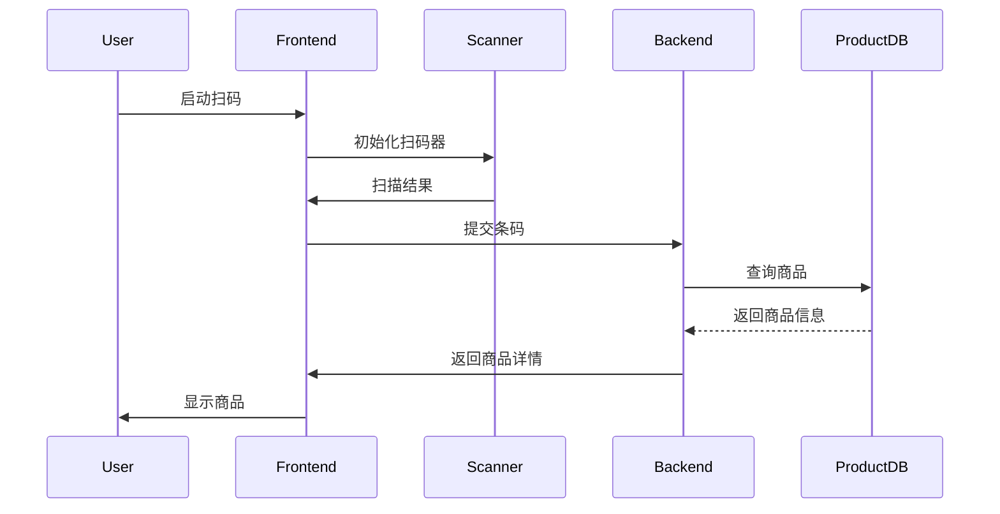
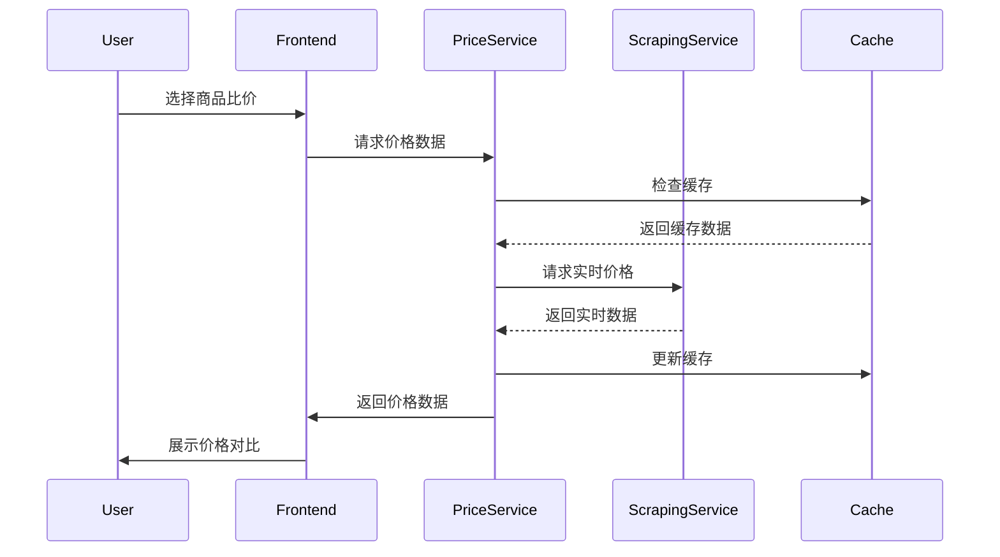
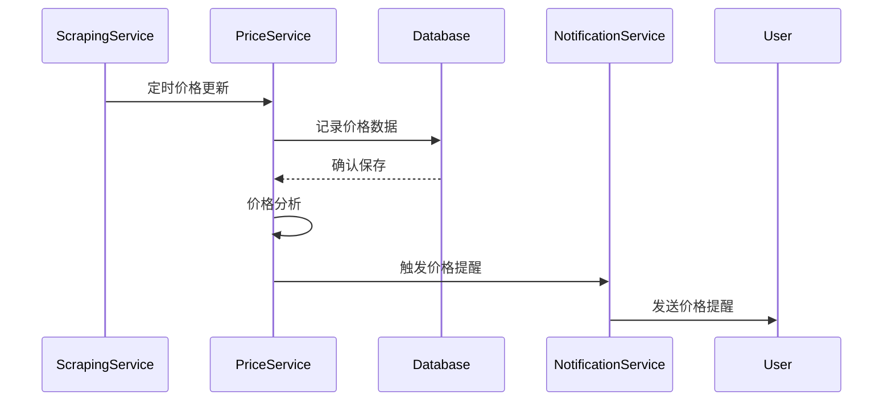
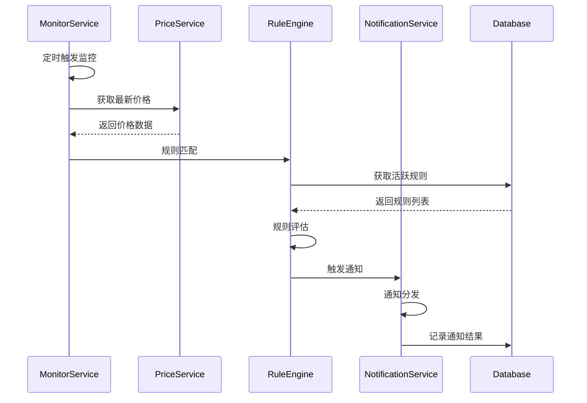
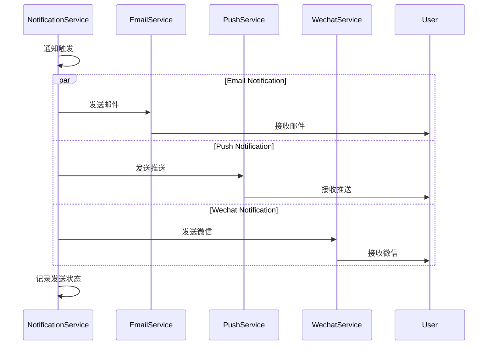
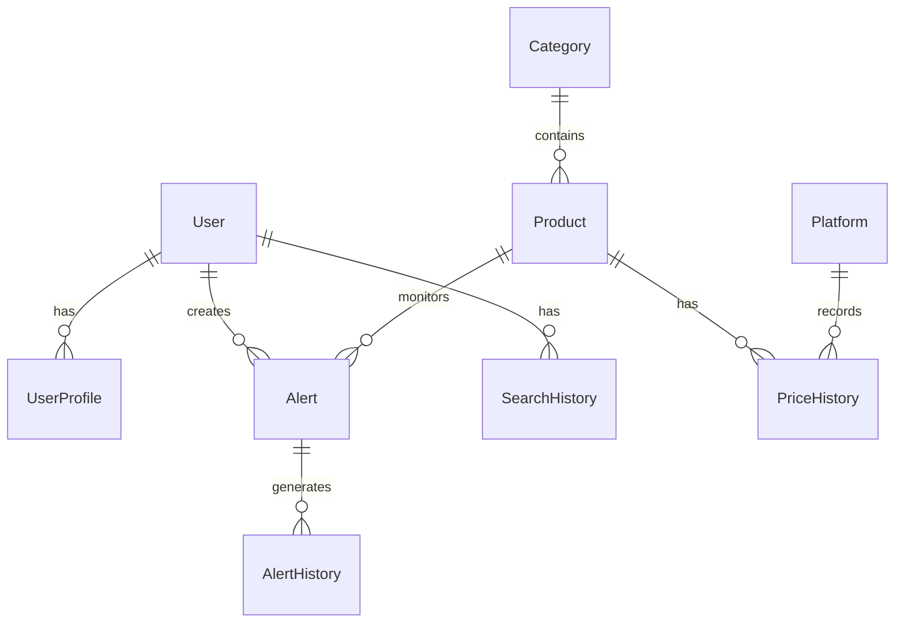

## 1 项目概述

### 1.1 项目背景

在电子商务日益普及的背景下，用户对商品价格的比较和获取变得更加重要。此项目旨在开发一个比价系统，用户可以通过该系统查询主流电商平台的商品价格，获取历史价格走势，并在价格下降时接收提醒。
### 1.2 项目目标

构建一个能够查询商品价格、提供价格走势图和降价提醒的比价系统，支持用户注册与登录，并实现移动端友好显示。

### 1.3 功能需求

#### 1.3.1 用户注册与登录

- **用户注册**:
  - 填写必要信息（用户名、密码、邮箱等）
  - 验证信息有效性：
    - 用户名、密码长度至少为6字节
    - 邮箱格式验证
    - 确保用户名和邮箱在系统中唯一
- **用户登录**:
  - 验证用户名和密码的正确性
  - 登录后可访问系统的其他功能

#### 1.3.2 商品价格查询

- **通过商品名称查询**:
  - 分词处理优化查询
  - 支持查询多个结果
  - 支持至少两个平台（如淘宝、京东）的价格查询
  - 针对需要用户登录的电商平台，支持用户验证
  - 显示商品信息并提供历史价格走势图表

#### 1.3.3 商品库建立

- **数据库设计**:
  - 保存商品信息，包括名称、多级品类、规格、条码、图片等
  - 支持商品价格的历史记录

#### 1.3.4 降价提醒功能

- 定时查询指定商品的最新价格
- 提供降价提醒方式（邮件、App推送等）

#### 1.3.5 移动端适配

- 优化样式以适应手机浏览器、微信等应用内置浏览器
- 如果开发手机App，支持相机拍摄商品图片或扫码条码查询商品 

### 1.4 技术架构

#### 1.4.1 前端技术栈

- Vue 3
- TypeScript
- Vite
- Pinia (状态管理)
- Naive UI (组件库)
- Axios (HTTP客户端)
- ECharts (图表可视化)

#### 1.4.2 后端技术栈

- Flask (Python Web框架)
- MySQL (数据库)
- Redis (缓存，可选)
- Celery (异步任务队列，用于价格监控)
- JWT (用户认证)

## 2 系统架构设计

### 2.1 整体架构

- 前端层：SPA应用 + 移动端适配
- 接口层：RESTful API
- 服务层：业务逻辑处理
- 数据层：MySQL存储 + Redis缓存
- 任务层：异步任务处理

### 2.2 系统模块划分

1. 用户认证模块
2. 商品搜索模块
3. 价格比较模块
4. 数据采集模块
5. 价格监控模块
6. 系统管理模块

## 3 功能模块设计

### 3.1 用户认证模块



#### 3.1.1 功能描述

- 用户注册：邮箱验证、用户名密码设置、基本信息填写
- 用户登录：账号密码登录、记住登录状态
- 密码重置：邮箱验证重置、安全问题验证
- 个人信息管理：基本信息修改、密码修改、通知设置

####  3.1.2 核心组件设计

1. 用户认证页面 (UserAuth.vue)
```typescript
interface UserState {
  isLoggedIn: boolean;
  userInfo: {
    id: number;
    username: string;
    email: string;
    avatar?: string;
    preferences: UserPreferences;
  };
  token: string;
}
```

2. 用户信息页面 (UserProfile.vue)
```typescript
// 组件结构
components/
  profile/
    UserProfile.vue        // 主信息页面
    BasicInfo.vue         // 基本信息编辑
    SecuritySettings.vue  // 安全设置
    NotificationConfig.vue // 通知配置
    
// 接口定义
interface UserProfile {
  basicInfo: {
    username: string;
    email: string;
    avatar: string;
    phoneNumber?: string;
  };
  securitySettings: {
    lastPasswordChange: Date;
    twoFactorEnabled: boolean;
    securityQuestions: SecurityQuestion[];
  };
  notificationSettings: {
    emailNotification: boolean;
    pushNotification: boolean;
    priceAlertThreshold: number;
  };
}
```

3. 状态管理 (LoginStore)
```typescript
// Pinia store 设计
export const useAuthStore = defineStore('auth', {
  state: (): UserState => ({
    isLoggedIn: false,
    userInfo: null,
    token: '',
  }),
  
  actions: {
    async login(credentials: LoginCredentials) {
      // 登录逻辑
    },
    async register(userData: RegisterData) {
      // 注册逻辑
    },
    async resetPassword(email: string) {
      // 密码重置逻辑
    },
    async updateProfile(data: Partial<UserProfile>) {
      // 更新个人信息
    },
    logout() {
      // 登出逻辑
    }
  },
  
  getters: {
    userDisplayName: (state) => state.userInfo?.username,
    isAuthenticated: (state) => state.isLoggedIn && !!state.token
  }
})
```

#### 3.1.3 功能实现流程

1. 用户注册流程


2. 登录认证流程


#### 3.1.4 安全考虑
1. 密码安全
- 使用bcrypt进行密码加密存储
- 密码强度要求：最少6位，包含大小写字母和数字
- 密码重试限制：5分钟内最多5次尝试

2. 会话安全
- JWT Token存储在localStorage
- Token有效期为24小时
- 使用refresh token机制
- 异地登录检测与提醒

3. 数据安全
- 所有API请求使用HTTPS
- 敏感信息传输加密
- XSS防护：输入过滤与转义

### 3.2 商品搜索模块


#### 3.2.1 功能描述
1. 商品名称搜索
   - 支持中文分词搜索
   - 智能联想与补全
   - 相关商品推荐
   - 搜索结果排序（价格、销量、评分等）

2. 商品分类浏览
   - 多级品类导航
   - 品类筛选
   - 热门品类推荐
   - 品类商品统计

3. 条码扫描搜索
   - 移动端相机扫码
   - 条码图片识别
   - 商品快速定位
   - 扫码历史记录

4. 搜索历史管理
   - 搜索记录保存
   - 热门搜索推荐
   - 搜索历史同步
   - 历史记录清理

#### 3.2.2 核心组件设计
1. 搜索栏组件 (SearchBar.vue)
```typescript
// 组件结构
components/
  search/
    SearchBar.vue          // 主搜索栏
    SearchSuggestions.vue  // 搜索建议
    SearchHistory.vue      // 搜索历史
    HotSearch.vue         // 热门搜索

// 组件接口定义
interface SearchState {
  keyword: string;
  suggestions: Suggestion[];
  history: SearchRecord[];
  hotSearches: HotSearch[];
  isLoading: boolean;
}

interface SearchConfig {
  debounceTime: number;     // 搜索防抖时间
  maxSuggestions: number;   // 最大建议数量
  maxHistory: number;       // 最大历史记录数
}

// 搜索建议实现
const useSuggestions = () => {
  const suggestions = ref<Suggestion[]>([]);
  const fetchSuggestions = useDebouncedRef((keyword: string) => {
    // 实时获取搜索建议
  }, 300);
  
  return {
    suggestions,
    fetchSuggestions
  };
};
```

2. 商品列表组件 (ProductList.vue)
```typescript
// 组件结构
components/
  product/
    ProductList.vue        // 商品列表
    ProductCard.vue       // 商品卡片
    ProductSort.vue       // 排序工具栏
    LoadMore.vue         // 加载更多

// 列表状态接口
interface ProductListState {
  products: Product[];
  loading: boolean;
  hasMore: boolean;
  sortBy: SortOption;
  pageSize: number;
  currentPage: number;
}

// 虚拟滚动优化
const useVirtualList = (list: Product[], options: VirtualOptions) => {
  // 虚拟列表实现
};
```

3. 筛选组件 (ProductFilter.vue)
```typescript
// 组件结构
components/
  filter/
    ProductFilter.vue      // 筛选主组件
    PriceRange.vue        // 价格区间
    CategoryTree.vue      // 分类树
    BrandFilter.vue       // 品牌筛选
    FilterTags.vue        // 已选筛选标签

// 筛选条件接口
interface FilterCondition {
  category?: string[];
  priceRange?: [number, number];
  brands?: string[];
  attributes?: Record<string, string[]>;
}

// 分类树数据结构
interface Category {
  id: string;
  name: string;
  level: number;
  children?: Category[];
  productCount: number;
}
```

4. 状态管理 (SearchStore)
```typescript
// Pinia store 设计
export const useSearchStore = defineStore('search', {
  state: (): SearchStoreState => ({
    currentKeyword: '',
    searchHistory: [],
    filterConditions: {},
    searchResults: {
      items: [],
      total: 0,
      loading: false
    },
    pagination: {
      currentPage: 1,
      pageSize: 20
    }
  }),
  
  actions: {
    async search(keyword: string) {
      // 搜索实现
    },
    async loadMore() {
      // 加载更多
    },
    async updateFilters(filters: FilterCondition) {
      // 更新筛选条件
    },
    addToHistory(keyword: string) {
      // 添加搜索历史
    }
  },
  
  getters: {
    formattedResults: (state) => state.searchResults.items.map(formatProduct),
    hasMore: (state) => state.searchResults.total > state.pagination.currentPage * state.pagination.pageSize
  }
})
```

#### 3.2.3 功能实现流程

1. 搜索流程


2. 条码扫描流程


#### 3.2.4 性能优化

1. 搜索优化
- 搜索关键词分词处理
- 搜索结果缓存
- 搜索建议防抖
- 热门搜索预加载

2. 列表优化
- 虚拟滚动
- 图片懒加载
- 数据分页
- 无限滚动

3. 缓存策略
- LocalStorage缓存搜索历史
- SessionStorage缓存筛选条件
- Redis缓存热门搜索
- 商品数据预缓存

### 3.3 价格比较模块

#### 3.3.1 功能描述
1. 多平台价格展示
   - 同款商品多平台比对
   - 价格、优惠、运费展示
   - 商品详情信息对比
   - 店铺信息与评分展示

2. 价格历史趋势
   - 价格走势图表展示
   - 历史最高/最低价标注
   - 价格波动分析
   - 自定义时间区间查看

3. 价格对比分析
   - 不同规格价格对比
   - 同类商品价格分布
   - 性价比分析
   - 优惠力度分析

4. 优惠信息展示
   - 优惠券信息聚合
   - 促销活动提醒 
   - 满减/满折信息
   - 红包/积分优惠

#### 3.3.2 核心组件设计
1. 价格对比页面 (PriceCompare.vue)
```typescript
// 组件结构
components/
  compare/
    PriceCompare.vue       // 价格对比主页面
    PlatformPrice.vue      // 平台价格卡片
    PriceAnalysis.vue      // 价格分析
    PromotionInfo.vue      // 优惠信息

// 接口定义
interface PriceInfo {
  platform: string;
  currentPrice: number;
  originalPrice: number;
  shipping: number;
  promotions: Promotion[];
  lastUpdate: Date;
  url: string;
}

interface Promotion {
  type: PromotionType;
  description: string;
  discount: number;
  startTime: Date;
  endTime: Date;
}

// 工具函数
const priceAnalysis = {
  calculateDiscount(original: number, current: number): number {},
  getBestDeal(prices: PriceInfo[]): PriceInfo {},
  formatPromotion(promotion: Promotion): string {}
};
```

2. 价格趋势图表 (PriceChart.vue)
```typescript
// 组件结构
components/
  chart/
    PriceChart.vue         // 价格趋势图
    ChartToolbar.vue       // 图表工具栏
    ChartLegend.vue        // 图例组件
    AnalysisCard.vue       // 分析卡片

// ECharts配置
const chartOptions = {
  tooltip: {
    trigger: 'axis',
    formatter: (params: any) => formatTooltip(params)
  },
  dataZoom: [
    {
      type: 'slider',
      show: true,
      start: 0,
      end: 100
    }
  ],
  series: [
    {
      type: 'line',
      smooth: true,
      markPoint: {
        data: [
          { type: 'max', name: '最高价' },
          { type: 'min', name: '最低价' }
        ]
      },
      markLine: {
        data: [
          { type: 'average', name: '平均价' }
        ]
      }
    }
  ]
};
```

3. 平台列表组件 (PlatformList.vue)
```typescript
// 组件结构
components/
  platform/
    PlatformList.vue       // 平台列表
    PlatformCard.vue       // 平台卡片
    PlatformSort.vue       // 平台排序
    
// 平台数据接口
interface Platform {
  id: string;
  name: string;
  logo: string;
  rating: number;
  responseTime: number;
  shipping: ShippingInfo;
  services: string[];
}

// 排序逻辑
const sortMethods = {
  byPrice: (a: PriceInfo, b: PriceInfo) => a.currentPrice - b.currentPrice,
  byRating: (a: Platform, b: Platform) => b.rating - a.rating,
  byShipping: (a: Platform, b: Platform) => a.shipping.cost - b.shipping.cost
};
```

4. 价格状态管理 (PriceStore)
```typescript
export const usePriceStore = defineStore('price', {
  state: (): PriceState => ({
    currentProduct: null,
    platformPrices: [],
    priceHistory: [],
    selectedTimeRange: '30d',
    compareList: [],
    loading: false
  }),

  actions: {
    async fetchPlatformPrices(productId: string) {},
    async fetchPriceHistory(productId: string, range: string) {},
    async addToCompare(productId: string) {},
    async refreshPrices() {},
    setTimeRange(range: string) {}
  },

  getters: {
    lowestPrice: (state) => Math.min(...state.platformPrices.map(p => p.currentPrice)),
    priceSpread: (state) => {
      const prices = state.platformPrices.map(p => p.currentPrice);
      return Math.max(...prices) - Math.min(...prices);
    },
    averagePrice: (state) => {
      const prices = state.platformPrices.map(p => p.currentPrice);
      return prices.reduce((a, b) => a + b, 0) / prices.length;
    }
  }
});
```

#### 3.3.3 功能实现流程

1. 价格比较流程


2. 价格监控更新流程


#### 3.3.4 性能优化

1. 数据处理优化
- 价格数据增量更新
- 冷热数据分离
- 批量数据处理
- 数据压缩存储

2. 查询优化
- 多级缓存策略
- 查询条件优化
- 索引优化
- 分布式查询

3. 展示优化
- 图表数据抽样
- 按需加载数据
- DOM更新优化
- 渲染性能优化

4. 爬虫策略
- 智能爬取频率
- IP代理池
- 请求限流
- 错误重试机制

### 3.4 价格监控模块

#### 3.4.1 功能描述
1. 降价提醒设置
   - 目标价格设置
   - 降价幅度设置
   - 监控时间设置
   - 多商品批量监控

2. 提醒规则管理
   - 规则优先级设置
   - 规则生效时间
   - 规则模板管理
   - 规则导入导出

3. 消息推送配置
   - 邮件通知
   - 浏览器推送
   - App推送
   - 微信推送（选配）

4. 监控历史记录
   - 价格变动记录
   - 触发记录查看
   - 历史记录导出
   - 数据可视化

#### 3.4.2 核心组件设计
1. 价格提醒设置 (PriceAlert.vue)
```typescript
// 组件结构
components/
  alert/
    PriceAlert.vue         // 价格提醒主组件
    AlertForm.vue          // 提醒设置表单
    AlertRules.vue         // 规则配置
    NotificationSettings.vue // 通知设置

// 提醒规则接口
interface AlertRule {
  id: string;
  productId: string;
  userId: string;
  targetPrice: number;
  dropPercentage: number;
  timeRange: [Date, Date];
  notifyMethods: NotifyMethod[];
  priority: number;
  status: RuleStatus;
}

interface NotifyMethod {
  type: 'email' | 'browser' | 'app' | 'wechat';
  config: NotifyConfig;
  enabled: boolean;
}

// 规则验证
const validateRule = (rule: AlertRule): ValidationResult => {
  // 规则验证逻辑
};
```

2. 提醒列表组件 (AlertList.vue)
```typescript
// 组件结构
components/
  alert/
    AlertList.vue          // 提醒列表
    AlertItem.vue          // 提醒项
    AlertStats.vue         // 统计信息
    BatchActions.vue       // 批量操作

// 列表状态管理
interface AlertListState {
  alerts: Alert[];
  loading: boolean;
  selectedAlerts: string[];
  filterCriteria: FilterCriteria;
  sortOption: SortOption;
}

// 批量操作
const batchActions = {
  enableAlerts: (ids: string[]) => {},
  disableAlerts: (ids: string[]) => {},
  deleteAlerts: (ids: string[]) => {},
  updateAlerts: (ids: string[], update: Partial<Alert>) => {}
};
```

3. 历史记录组件 (AlertHistory.vue)
```typescript
// 组件结构
components/
  history/
    AlertHistory.vue       // 历史记录主组件
    HistoryChart.vue       // 历史图表
    HistoryList.vue        // 历史列表
    ExportTools.vue        // 导出工具

// 历史记录接口
interface AlertHistory {
  id: string;
  ruleId: string;
  productId: string;
  triggerTime: Date;
  priceChange: {
    before: number;
    after: number;
    percentage: number;
  };
  notificationResult: NotificationResult[];
}

// 图表配置
const chartConfig = {
  type: 'line',
  options: {
    scales: {
      x: {
        type: 'time',
        time: {
          unit: 'day'
        }
      },
      y: {
        beginAtZero: true
      }
    }
  }
};
```

4. 监控状态管理 (AlertStore)
```typescript
export const useAlertStore = defineStore('alert', {
  state: (): AlertState => ({
    userAlerts: [],
    alertHistory: [],
    notificationSettings: null,
    activeMonitors: 0,
    loading: {
      alerts: false,
      history: false
    }
  }),

  actions: {
    async createAlert(alert: NewAlert) {},
    async updateAlert(id: string, update: Partial<Alert>) {},
    async deleteAlert(id: string) {},
    async fetchAlertHistory(filters: HistoryFilters) {},
    async updateNotificationSettings(settings: NotificationSettings) {},
    async testNotification(method: NotifyMethod) {}
  },

  getters: {
    activeAlerts: (state) => state.userAlerts.filter(a => a.status === 'active'),
    alertsByProduct: (state) => groupBy(state.userAlerts, 'productId'),
    recentHistory: (state) => state.alertHistory.slice(0, 10)
  }
});
```

#### 3.4.3 功能实现流程

1. 监控任务处理流程


2. 通知发送流程


#### 3.4.4 系统优化

1. 监控任务优化
- 任务优先级队列
- 任务动态调度
- 失败重试机制
- 任务负载均衡

2. 通知优化
- 消息去重合并
- 通知频率控制
- 智能通知时间
- 通知渠道备份

3. 存储优化
- 历史记录分表
- 冷热数据分离
- 数据定期归档
- 索引优化

## 4. 数据库设计

### 4.1 数据库架构


### 4.2 核心表结构

1. Item

| 列名          | 数据类型     | 描述                           |
| ------------- | ------------ | ------------------------------ |
| id            | Integer      | 主键                           |
| title         | String(200)  | 商品标题（必填）               |
| search_title  | String(255)  | 用于中文分词的搜索标题（必填） |
| link          | String(255)  | 商品链接（必填）               |
| image_url     | String(255)  | 图片链接（可选）               |
| create_time   | DateTime     | 创建时间                       |
| update_time   | DateTime     | 更新时间                       |
| current_price | Float        | 当前价格（必填）               |
| platform      | String(100)  | 商品所在的平台（可选）         |
| platform_info | Relationship | 与 `Platform` 表的关系         |
| shop          | String(255)  | 商店名称（可选）               |
| shop_link     | String(255)  | 商店链接（可选）               |
| sku           | String(255)  | SKU 编号（唯一）               |

**唯一约束：**

- (`title`, `shop`) 的联合唯一约束

2. Platform

| 列名     | 数据类型    | 描述                     |
| -------- | ----------- | ------------------------ |
| id       | BigInteger  | 主键                     |
| name     | String(50)  | 平台名称（必填，唯一）   |
| logo_url | String(255) | 平台 logo 的链接（可选） |

3. PriceAlert

| 列名                | 数据类型   | 描述                                   |
| ------------------- | ---------- | -------------------------------------- |
| id                  | Integer    | 主键                                   |
| user_id             | Integer    | 外键，指向 `users` 表的用户 ID（必填） |
| item_id             | Integer    | 外键，指向 `items` 表的商品 ID（必填） |
| target_price        | Float      | 触发警报的目标价格（必填）             |
| created_at          | DateTime   | 创建时间                               |
| updated_at          | DateTime   | 最后更新时间                           |
| enable              | Boolean    | 是否启用该价格提醒                     |
| check_interval      | Integer    | 检查价格的间隔时间（单位：分钟）       |
| notification_method | String(50) | 提醒通知方式（必填）                   |

**唯一约束：**
- (`user_id`, `item_id`) 的联合唯一约束

---

4. AlertHistory

| 列名                | 数据类型       | 描述                         |
| ------------------- | -------------- | ---------------------------- |
| id                  | Integer        | 主键                         |
| alert_id            | Integer        | 外键，指向 `PriceAlert` 表   |
| price_before        | Numeric(10, 2) | 提醒触发前的商品价格         |
| price_after         | Numeric(10, 2) | 提醒触发后的商品价格         |
| notification_status | JSON           | 通知状态（以 JSON 格式存储） |
| created_at          | DateTime       | 创建时间                     |

**索引：**
- `alert_id` 列的索引
- `created_at` 列的索引

---

5. PriceHistory

| 列名        | 数据类型       | 描述                                       |
| ----------- | -------------- | ------------------------------------------ |
| id          | Integer        | 主键                                       |
| item_id     | Integer        | 外键，指向 `items` 表的商品 ID（必填）     |
| platform_id | Integer        | 外键，指向 `platforms` 表的平台 ID（必填） |
| price       | Numeric(10, 2) | 商品在某一时刻的价格                       |
| date        | TIMESTAMP      | 记录价格的时间                             |

**索引：**
- (`item_id`, `platform_id`) 的联合索引

## 5. API接口设计

### 5.1 接口规范

#### 5.1.1 基础规范
- 基础路径: `/api`
- 请求方法: 严格遵循 RESTful 规范
- 响应格式: 统一使用 JSON 格式
- 状态码: 遵循 HTTP 标准状态码
- 认证方式: JWT Token (在 Header 中使用 `Authorization: Bearer <token>`)

#### 5.1.2 响应格式
```json
{
    "code": 0,           // 业务状态码，0表示成功
    "message": "success", // 状态描述
    "data": {            // 业务数据
        // 具体数据结构
    },
    "timestamp": "2024-11-13T10:00:00Z"  // 响应时间戳
}
```

#### 5.1.3 错误处理
```json
{
    "code": 1,        // 错误码
    "message": "Invalid parameter", // 错误描述
    "details": {         // 详细错误信息
        "field": "username",
        "reason": "length must be at least 6 characters"
    },
    "timestamp": "2024-11-13T10:00:00Z"
}
```

#### 5.1.4 分页参数
- page: 当前页码，默认1
- size: 每页大小，默认20
- sort: 排序字段
- order: 排序方向 (asc/desc)

### 5.2 接口清单

#### 5.2.1 用户认证类接口

1. 用户注册
```
POST /api/user/signup
Request:
{
    "username": string,  // 用户名
    "password": string,  // 密码
    "email": string,     // 邮箱
}
Response:
{
	// 通过状态码反映是否注册成功
}
```

2. 用户登录
```
POST /api/user/login
Request:
{
    "username": string,  // 用户名/邮箱
    "password": string,  // 密码
}
Response:
{
    "token": string,
    "refreshToken": string
}
```

3. 重置密码
```
POST /api/auth/reset-password
Request:
{
    "email": string
}
```

4. 验证邮箱
```
GET /api/auth/verify-email
Query:
- token: string  // 验证token
```

#### 5.2.2 用户信息类接口

1. 获取用户信息
```
GET /api/user/auth/loginInfo
Response:
{
    "username": string,
    "email": string,
    "avatar": string,
    "watchList": object
}
```

2. 更新用户信息
```
PUT /api/user/auth/loginInfo
Request:
{
    "avatar": string,
    "watchList": object
}
```

#### 5.2.3 商品搜索类接口

1. 商品搜索
```
GET /api/search
Query:
- keyword: string       // 搜索关键词
- category: string      // 分类ID
- price_min: number    // 最低价
- price_max: number    // 最高价
- platform: string[]   // 平台筛选
- page: number        // 页码
- size: number        // 每页数量
```

2. 商品分类列表
```
GET /api/v1/categories
Query:
- parent_id: string   // 父分类ID
- level: number      // 分类层级
```

3. 商品详情
```
GET /api/items/:id
```

#### 5.2.4 价格比较类接口

1. 获取商品价格对比
```
GET /api/items/:id/prices
Query:
- platforms: string[]  // 指定平台
```

2. 获取历史价格
```
GET /api/items/:id/price-history
Query:
- platform: string    // 平台ID
- start_date: string  // 开始日期
- end_date: string    // 结束日期
```

3. 获取优惠信息
```
GET /api/items/:id/promotions
Query:
- platform: string   // 平台ID
```

#### 5.2.5 价格监控类接口

1. 创建价格提醒
```
POST /api/alerts
Request:
{
    "itemId": string,
    "targetPrice": number,
    "notificationMethods": string[]
}
```

2. 获取提醒列表
```
GET /api/alerts
Query:
- status: string    // 提醒状态
- page: number
- size: number
```

3. 更新提醒设置
```
PUT /api/alerts/:id
Request:
{
    "targetPrice": number,
    "notificationMethods": string[]
}
```

4. 获取提醒历史
```
GET /api/alerts/:id/history
Query:
- start_date: string
- end_date: string
- page: number
- size: number
```

### 5.3 接口权限控制

#### 5.3.1 权限等级
1. 公开接口（无需认证）
- 商品搜索
- 商品分类
- 价格对比查看

2. 用户接口（需要认证）
- 用户信息操作
- 搜索历史
- 价格监控设置

### 5.4 接口测试

## 6. 安全设计

### 6.1 用户认证
- JWT Token认证
- 密码加密存储
- 登录失败限制

### 6.2 数据安全
- HTTPS传输
- 敏感信息加密
- SQL注入防护
- XSS防护

## 7. 部署方案

### 7.1 环境要求
- Node.js >= 16
- Python >= 3.8
- MySQL >= 8.0
- Redis >= 6.0

### 7.2 部署架构
- 使用Docker容器化部署
- Nginx反向代理
- 分布式部署支持

## 8. 开发规范

### 8.1 代码规范
- ESLint + Prettier配置
- TypeScript类型检查
- Python PEP8规范

### 8.2 Git工作流
- 分支管理策略
- 提交信息规范
- 代码审查流程

## 9. 项目进度规划

### 9.1 开发阶段
1. 需求分析与设计：2024/11/1 - 2024/11/15
2. 基础架构搭建：2024/11/16 - 2024/11/30
3. 核心功能开发：2024/12/1 - 2024/12/15
4. 测试与优化：2024/12/16 - 2024/12/25
5. 部署与交付：2024/12/26 - 2025/1/1

### 9.2 里程碑
1. 设计文档提交：2024/11/15
2. 核心功能完成：2024/12/15
3. 项目最终交付：2025/1/1

## 10. 测试计划

### 10.1 测试范围
- 单元测试
- 接口测试
- UI测试
- 性能测试
- 兼容性测试

### 10.2 测试工具
- Jest (前端单元测试)
- Pytest (后端单元测试)
- Postman (接口测试)
- Cypress (E2E测试)

## 11. 项目风险评估

### 11.1 技术风险
- 第三方平台API限制
- 数据采集合规性
- 系统性能瓶颈

### 11.2 风险控制措施
- 备选方案准备
- 性能优化策略
- 合规性评估
- 

[API设计](API文档.md) 

### 用户注册与登录

使用令牌进行用户状态管理。令牌是一种无状态的用户认证方式，它通常采用JSON Web Token（JWT）格式。这种机制将用户认证信息直接嵌入令牌中，从而无需服务器存储会话信息。
#### 登陆流程

1. **用户登录**：用户通过登录接口提交用户名和密码。
2. **生成Token**：后端验证用户身份成功后，生成一个令牌。令牌通常包含用户信息、有效期、签名等。
3. **返回Token**：令牌返回给客户端，由客户端（如浏览器或移动应用）保存在`localStorage`中。
#### 后续请求

1. **请求携带Token**：客户端每次请求时，将Token放在HTTP请求头（`Authorization: Bearer <token>`）中发送到服务器。
2. **Token验证**：后端验证Token的签名和有效期，确认用户身份。
3. **Token失效处理**：当Token过期后，用户需要重新登录以获取新的令牌，或通过刷新Token机制（如Refresh Token）来延长会话。


```javascript
// 登陆的信息接口
export interface LoginInfo {
  uid: string,
  username: string,
  password: string,
  email: string,
  avatar: string,
  isLogin: boolean,
}

// 用户登陆时发送的请求以及收到的回应信息接口
export interface LoginData{
    name: string;
    password: string;
}

export interface LoginResponse{
    token: string;
}

export interface RegisterInfo{
    name: string;
    password: string;
    email: string;
}

```

### 用户搜索

前端通过搜索栏输入`keyword`后按下搜索按钮发起搜索请求，请求被封装成`SearchPramas`的形式，包含关键词、结果排序、分页数、分类、筛选等条件。

后端接收请求后，进行搜索。
- 首先调用创建好的爬虫对象更新搜索关键字，然后从网站抓取商品数据获取商品信息列表。
- 检查每个商品的SKU是否已经存在于数据库中。如果存在，则更新商品的价格信息；如果不存在，则添加新商品进数据库，在添加。
- 如果在爬虫抓取数据过程中发生异常（比如当前时间段网站繁忙），就从数据库中查找匹配关键字的商品。
#### 全文搜索

##### 分词处理

mysql全文检索是以词为基础的。MySQL默认的分词实现把**所有非字母和数字的特殊符号**都看作分词符。为了实现关键词的全文搜索，在加入商品时首先要对商品标题进行**分词处理**。

这里使用了`jieba`，并且以空格作为示意mysql分词的提示。

```python
def segment_text(text):
    return ' '.join(jieba.cut(text)) 
```

在数据库中的存储类似于。


##### 关联优化

在mysql中有两种模式的全文搜索可选：
- **NATURAL LANGUAGE MODE**：按相关性排序，基于词频，适合一般的全文搜索。
- **BOOLEAN MODE**：可以使用布尔运算符来精确控制查询，适合需要更复杂条件的查询。

为了优化搜索结果的相关性，每次搜索后，在搜索索引中加入查询关键词再更新/加入数据库，以提高搜索结果的关联度。

```python
search_title = (keyword+' '+segment_text(result['title']))[:255]
```

全文搜索操作通过封装`fulltextsearch` 函数实现

```python
def fulltextsearch(keyword):
    query = text("SELECT * FROM items WHERE MATCH(search_title) AGAINST(:keyword IN NATURAL LANGUAGE MODE)")
    result = db.session.execute(query, {'keyword': keyword})
    return result.fetchall()
```

由于`Flask-SQLAlchemy`不支持创建全文索引，需要在初始化数据库的时候手动执行mysql语句创建索引

```python
# app.py

def db_init(app):
    with app.app_context():
        db.drop_all()
        db.create_all()  # 数据库初始化
        db.session.execute(text('CREATE FULLTEXT INDEX idx_title ON items(search_title);'))
    print('Database initialized')
```
#### 爬虫处理

爬虫有两种方案：

- 第一种方式是使用request模拟请求，并使用bs4解析respond得到数据。
- 第二种是使用selenium和无头浏览器，selenium自动化操作无头浏览器，由无头浏览器实现请求，对得到的数据进行解析。

##### 京东

- 京东的登录通常需要模拟用户输入用户名、密码以及验证码。可以手动登录京东，获取登录后 `cookie`，然后将 `cookie` 传递给爬虫使用。**使用程序自动登录**（例如使用 `requests` 或 `selenium`）：模拟登录过程，自动获取 `cookie`。但自动登录涉及处理验证码，这需要复杂的机制，可以用 `selenium` 实现模拟登录。
- 根据用户提供的关键词，构建搜索 URL 并请求搜索页面。京东的搜索链接通常包含 `keyword`（关键词）和 `page`（页数）参数。
   ```python
   keyword = "手机"
   start_url = 'https://search.jd.com/Search?keyword=' + keyword + '&enc=utf-8&wq=' + keyword
   print("搜索链接：", start_url)
   ```
- 使用 request 向搜索链接发送请求，需要将 `cookie` 添加到请求头中，以确保爬虫模拟登录后的状态。
   ```python
   response = requests.get(start_url, headers={
       'User-Agent': 'Mozilla/5.0 (Windows NT 10.0; Win64; x64) AppleWebKit/537.36 (KHTML, like Gecko) Chrome/80.0.3987.149 Safari/537.36',
       'cookie': cookie  # 使用登录后的cookie
   })
   response.encoding = 'utf-8'
   ```
- 使用 `BeautifulSoup` 解析获取的 HTML 内容，以便从中提取需要的商品信息。在解析后的页面中，定位到包含商品信息的标签，例如商品的 `sku`、`名称`、`价格` 等。通过选择器来定位到包含商品数据的 HTML 元素。 京东的商品信息通常位于 `#J_goodsList > ul` 标签下，每个商品的信息会在 `li.gl-item` 标签中。通过 `soup.select()` 或 `soup.find_all()` 方法，定位到所有商品元素。
   ```python
   # 使用 BeautifulSoup 解析页面内容
   soup = BeautifulSoup(response.text, 'html.parser')
    # 定位到商品列表
   goods_list = soup.select('#J_goodsList > ul > li.gl-item')
   ```
## 状态设计  

描述应用涉及的关键领域对象, 比如外形、行为和关系. 如果是OOP方式，可以使用UML描述  

## 接口设计  

- 后端返回格式，`code=0`表示正常，`code!=0`表示错误。

```json
{
	code: 0,
	message: 'success',
	data: {
		Token: "abc"
	}
}
```

## 项目要求和目标  

项目目标、运行环境、兼容性要求、性能指标等等  

## 验证  

可选, 风险评估、异常情况考虑、特殊测试规则、测试指导等等  

## 分工和版本计划  

可选, 可以在单独文档或者看板中维护  

## 构建说明  

可选, 项目组织、构建、测试说明  

## 文档索引  

相关文档的索引和链接  

## 参考资料  

文档中索引页的外部参考资料  
